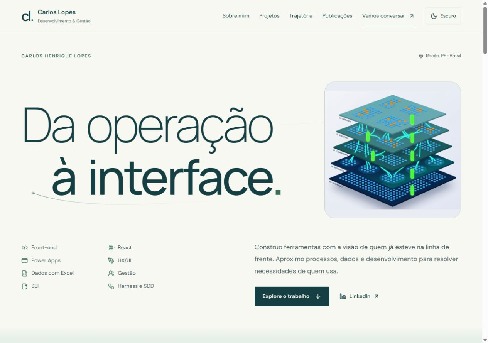
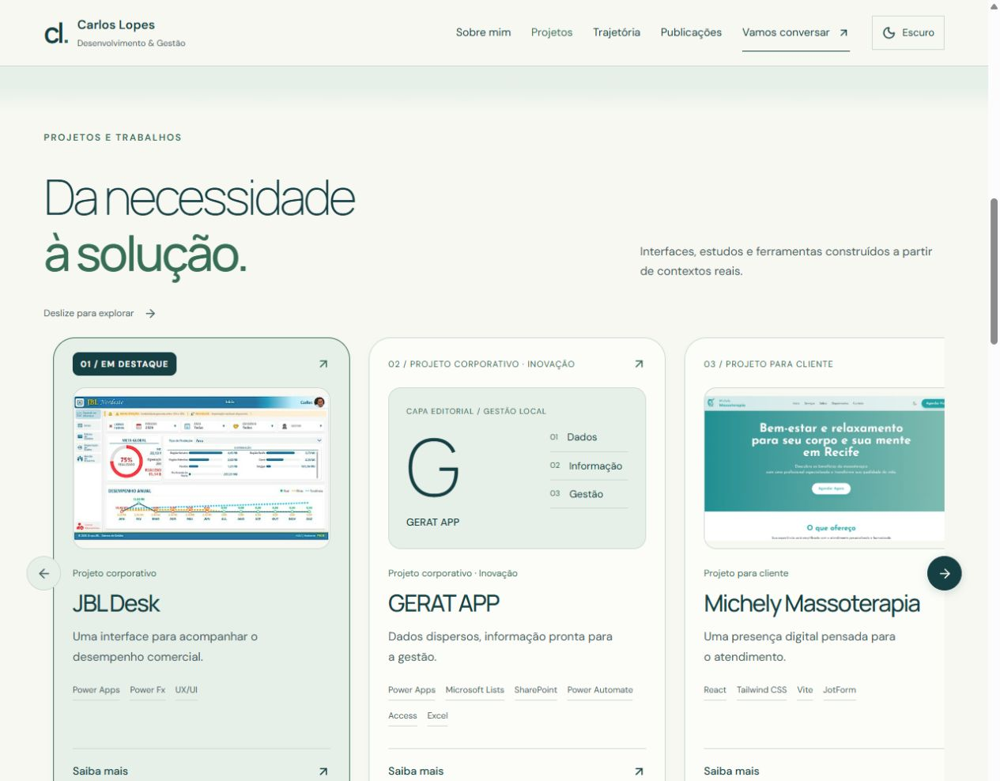
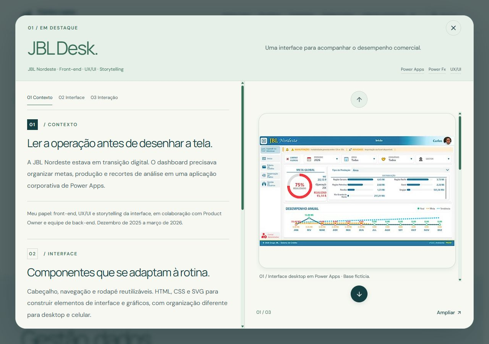
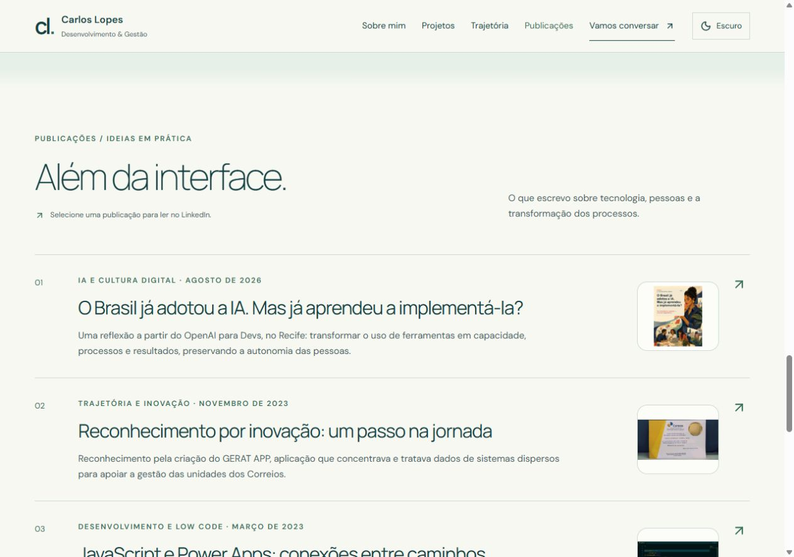
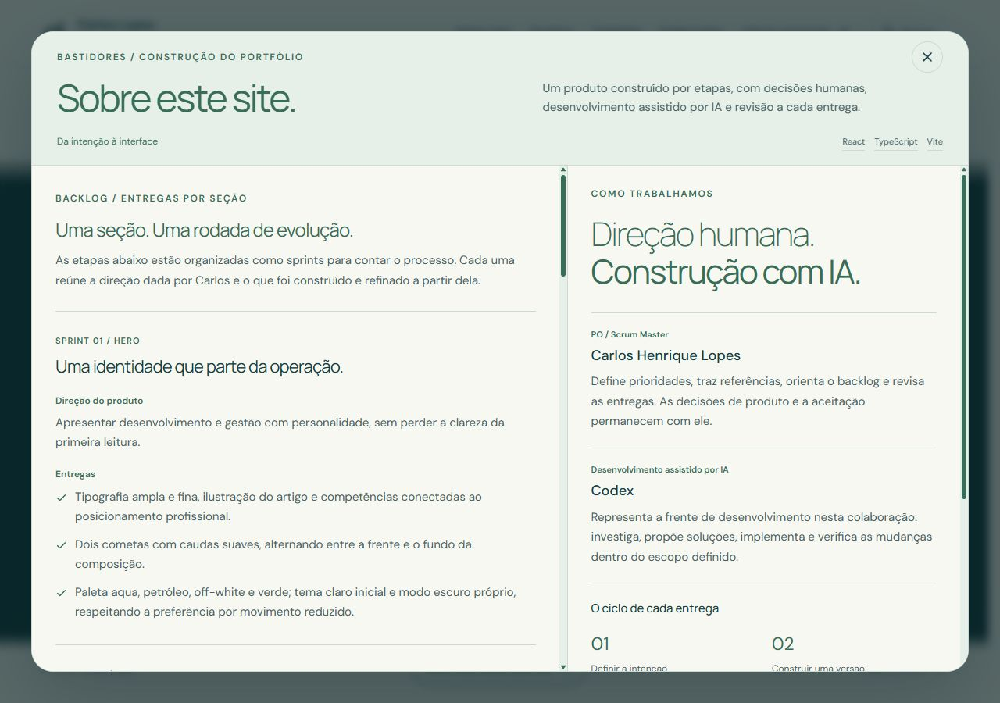
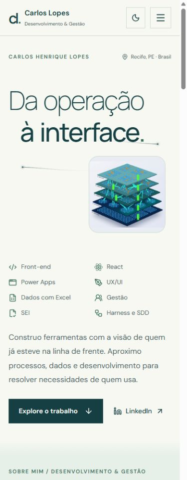
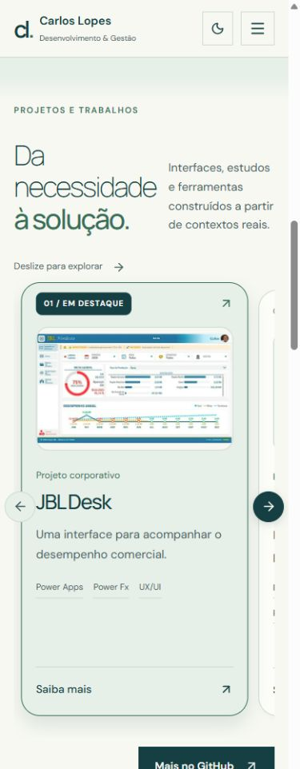
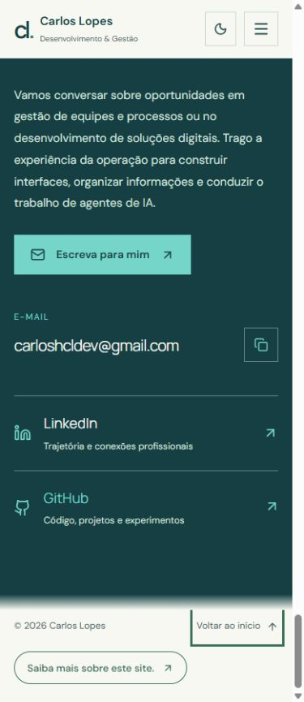
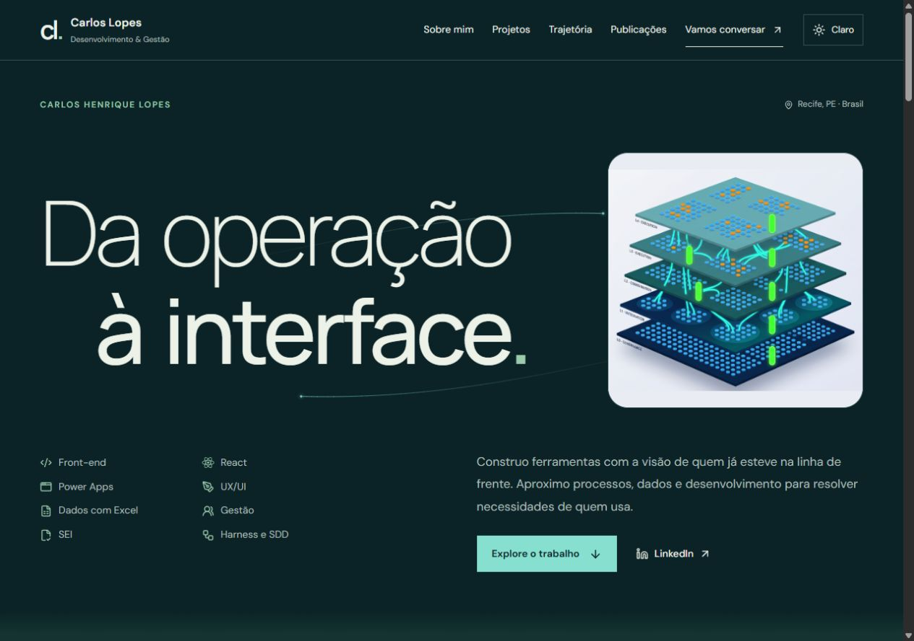

#  Carlos Henrique Lopes · Portfólio


> **Da operação à interface.** Um portfólio que conecta gestão de equipes e processos, desenvolvimento de interfaces, dados e condução do trabalho de agentes de IA.

**[Explorar a nova versão](https://deploy-preview-1--portfoliocarloslopes.netlify.app/)** · [Acompanhar a reformulação no PR #1](https://github.com/CHCLopes/Portfolio/pull/1) · [LinkedIn](https://www.linkedin.com/in/carlos-lopes-b445aa201/)

## 🎯 Preview

Capturas reais da reformulação em revisão. As imagens ficam em [`docs/images`](./docs/images) e podem ser abertas em tamanho completo.

### Desktop

| Hero | Sobre mim | Projetos e Trabalhos |
| :---: | :---: | :---: |
|  |  |  |

| Detalhes de um projeto | Publicações | Processo de construção |
| :---: | :---: | :---: |
|  |  |  |

### Mobile

| Apresentação | Carrossel | Contato e rodapé |
| :---: | :---: | :---: |
|  |  |  |

## ✨ Sobre o projeto

Este portfólio apresenta a trajetória de **Carlos Henrique Lopes**, relacionando experiência em operações, liderança, educação corporativa e análise de dados à construção de soluções digitais.

A leitura começa com o posicionamento profissional, passa pela apresentação pessoal e chega aos projetos com contexto. Depois, reúne experiências, formação, publicações e caminhos de contato. A proposta é permitir que quem visita entenda **quem conduz o trabalho, qual problema cada solução aborda e qual foi a contribuição de Carlos**.

A reformulação continua o histórico de [CHCLopes/Portfolio](https://github.com/CHCLopes/Portfolio), cuja versão anterior foi construída em HTML/CSS a partir da formação da Alura. A apresentação atual usa React e TypeScript e foi refinada por seção, a partir de referências, mockups e revisão humana.

## 🛠️ Tecnologias

| Camada | Ferramentas e uso |
| --- | --- |
| Interface | **React 19** e **TypeScript 5**: componentes, conteúdo tipado e estados de interação |
| Desenvolvimento e build | **Vite 7**: servidor local, compilação e prévia do build |
| Estilização | **CSS com tokens semânticos** e **Tailwind CSS 3**, alinhados à mesma paleta |
| Ícones | **Lucide React** e **React Icons** |
| Tipografia | **Manrope** e **DM Sans**, servidas localmente com suas licenças OFL |
| Qualidade | **TypeScript** e **ESLint** |
| Hospedagem | **Netlify**, com prévia por pull request e configuração em [`netlify.toml`](./netlify.toml) |
| Apoio ao desenvolvimento | **Codex**, sob direção, revisão e aceitação de Carlos |

## 🚀 Recursos

- **Hero com identidade própria:** ilustração, competências e dois cometas com caudas que desvanecem, alternando entre a frente e o fundo da composição.
- **Apresentação antes dos projetos:** contexto profissional e retrato logo após o Hero.
- **Carrossel horizontal:** oito projetos e trabalhos, controles laterais, indicação de exploração e destaque visual para o JBL Desk.
- **Modais de projeto:** cabeçalho fixo, texto com rolagem própria e galeria vertical de imagens no desktop; composição em uma coluna no celular.
- **Trajetória e formação:** experiências que conectam gestão, processos, dados, desenvolvimento e educação corporativa, com acesso ao currículo.
- **Publicações:** cinco itens em ordem cronológica decrescente, com miniaturas, datas e links para os originais no LinkedIn.
- **Contato direto:** e-mail, LinkedIn e GitHub, além de cópia do endereço de e-mail com mensagem de retorno.
- **Bastidores no rodapé:** “Saiba mais sobre este site.” abre o relato da construção, organizado em sete sprints por seção.
- **Dois temas:** modo claro no primeiro acesso e modo escuro na mesma identidade visual, com persistência da escolha.

### Projetos apresentados

| Projeto | Contexto e contribuição |
| --- | --- |
| **JBL Desk** | Front-end, UX/UI e storytelling de uma aplicação em Power Apps para a JBL Nordeste; construção com apoio de agentes de IA usando Gemini |
| **GERAT APP** | Aplicação interna de gestão nos Correios, reconhecida por inovação; front-end e atuação como agilista em equipe com PO e back-end |
| **Michely Massoterapia** | Site de serviços para cliente, com apresentação, navegação e caminhos de atendimento e agendamento |
| **Endereçador** | Ferramenta para preparar etiquetas e declarações de conteúdo a partir de uma necessidade operacional |
| **Sk8-Genius** | Jogo de memória com interação, controles e recursos de áudio |
| **Bikcraft** | Estudo de HTML/CSS e responsividade, com atribuição do layout à Origamid |
| **Desenvolvimento assistido por IA** | Caderno de estudo sobre especificação, contexto e revisão do trabalho da IA |
| **MyAntigravityHarness** | Projeto de governança de agentes e desenvolvimento orientado por especificações (SDD) |

> [!NOTE]
> O **JBL Desk usa uma base fictícia**, criada para trabalhar a interface. Os números das capturas não representam resultados comerciais medidos. Sua galeria reúne uma tela desktop e as telas **Mobile 01** e **Mobile 05**. O GERAT APP apresenta o certificado disponível; sua capa editorial não simula uma captura da aplicação. Os estudos também identificam suas capas editoriais e atribuições.

## 🎨 Design system e experiência

A identidade combina **azul petróleo, aqua, off-white e tons de verde**. Os temas compartilham tokens semânticos, com cores próprias para superfícies, texto, controles e destaques.

| Token | Tema claro | Tema escuro |
| --- | --- | --- |
| Fundo principal | `#F7F8F2` | `#0B2226` |
| Superfície dos cards | `#FCFDF8` | `#112F33` |
| Texto principal | `#153F43` | `#EDF2E9` |
| Destaque aqua | `#75D5C8` | `#86DFCF` |
| Verde | `#386E58` | `#9BCAAC` |
| Superfície verde suave | `#E6EFE8` | `#143331` |

| Modo claro | Modo escuro |
| :---: | :---: |
|  |  |

- **Tipografia:** títulos amplos, com pesos finos em pontos de destaque; Manrope nos títulos e DM Sans no corpo.
- **Composição:** imagens e cards com cantos arredondados, sombras discretas e espaço para leitura.
- **Transições:** degradês curtos entre seções e movimento sutil nos cards em dispositivos com mouse.
- **Responsividade:** navegação móvel, carrossel por rolagem e reorganização dos modais conforme a largura.

### Navegação e acessibilidade

- Link para pular ao conteúdo e foco visível nos controles.
- Modais nativos com fechamento pelo botão, Escape ou fundo externo e retorno do foco ao acionador.
- Rolagem da página bloqueada enquanto um modal está aberto.
- Menu móvel com fechamento por Escape e retorno de foco.
- Respeito a `prefers-reduced-motion` nos cometas, transições e rolagens animadas.
- Imagens com texto alternativo e feedback acessível na cópia de e-mail.
- Metadados de descrição e Open Graph; fontes locais com pré-carregamento.

As decisões de composição e comportamento estão documentadas em [`DESIGN_SYSTEM.md`](./DESIGN_SYSTEM.md).

## 🧭 Processo de construção

O portfólio também registra a forma como foi construído: **Carlos conduz o produto; a IA apoia o desenvolvimento**.

- **Carlos · PO / Scrum Master:** define intenção, prioridades e escopo, traz referências e mockups, revisa as entregas e decide sua aceitação.
- **Codex · desenvolvimento assistido por IA:** investiga o projeto, propõe soluções, implementa mudanças e executa verificações dentro do escopo definido.

O ciclo é **definir → construir → verificar e revisar → refinar com feedback**. O modal do rodapé organiza as etapas como sprints, uma por seção, com direção do produto e entregas. Essa organização relata o processo realizado, sem atribuir prazos ou métricas não registrados.

Os refinamentos permanecem na mesma branch e no mesmo PR em rascunho, com prévia da Netlify para revisão antes da incorporação à versão publicada.

## 📊 Status e publicação

**Reformulação em andamento, com prévia disponível para revisão.**

| Ambiente | Endereço | Situação |
| --- | --- | --- |
| Prévia da reformulação | [deploy-preview-1--portfoliocarloslopes.netlify.app](https://deploy-preview-1--portfoliocarloslopes.netlify.app/) | Versão apresentada neste README |
| Site publicado | [portfoliocarloslopes.netlify.app](https://portfoliocarloslopes.netlify.app/) | Versão anterior, enquanto a reformulação aguarda incorporação |
| Revisão no GitHub | [Pull request #1](https://github.com/CHCLopes/Portfolio/pull/1) | Rascunho na branch `codex/remodelacao-portfolio` |

A Netlify usa **Node.js 22**, executa `npm run build` e publica `dist/`. A navegação interna usa âncoras; os caminhos antigos `/about.html`, `/working.html` e `/contact.html` possuem redirecionamentos permanentes para as seções correspondentes. O histórico anterior permanece no mesmo repositório.

As verificações realizadas durante os refinamentos incluem **build, lint e revisão visual nos dois temas**, com conferência de teclado, modais e larguras de 320, 390 e 768 px, além de desktop. Elas documentam a validação da interface, sem representar uma medição de conversão ou desempenho comercial.

## 📦 Executar localmente

**Pré-requisitos:** Node.js 22 e npm.

> [!NOTE]
> Enquanto o PR estiver em revisão, os comandos abaixo usam a branch da reformulação. A branch `main` conserva a versão publicada anterior.

```bash
git clone --branch codex/remodelacao-portfolio https://github.com/CHCLopes/Portfolio.git
cd Portfolio
npm ci
npm run dev
```

O Vite informa no terminal o endereço do servidor local.

| Comando | Finalidade |
| --- | --- |
| `npm run dev` | Iniciar o servidor de desenvolvimento |
| `npm run lint` | Verificar o código com ESLint |
| `npm run build` | Verificar os tipos e gerar a versão de produção em `dist/` |
| `npm run preview` | Servir localmente o build já gerado |

Para verificar e visualizar o build:

```bash
npm run lint
npm run build
npm run preview
```

## 🗂️ Organização do código

```text
src/
├── components/           # Navegação, temas, cometas, modais e galerias
├── sections/             # Hero, apresentação, projetos, trajetória, publicações e contato
├── data/                 # Perfil, projetos, imagens, publicações e sprints
├── App.tsx               # Ordem das seções
├── index.css             # Tokens, composição, responsividade e movimento
├── project-showcase.css  # Carrossel e modais de projetos
└── site-process.css      # Rodapé e modal do processo
public/
├── fonts/                # Fontes locais e licenças
├── hero/                 # Ilustração do Hero
├── projects/             # Capturas e galerias dos projetos
├── publications/         # Miniaturas e registros de origem
├── profile.jpg           # Retrato profissional
└── carlos-lopes-trajetoria.pdf
docs/images/              # Capturas usadas neste README
DESIGN_SYSTEM.md          # Decisões visuais e de interação
netlify.toml              # Build, publicação e redirecionamentos
```

Os registros de origem das imagens estão em [`public/projects/gallery/sources.json`](./public/projects/gallery/sources.json) e [`public/publications/sources.json`](./public/publications/sources.json). Capturas internas de revisão e backups locais ficam fora do Git.

## 📞 Contato

**Carlos Henrique Lopes · Desenvolvimento & Gestão**

[LinkedIn](https://www.linkedin.com/in/carlos-lopes-b445aa201/) · [GitHub](https://github.com/CHCLopes) · [E-mail](mailto:carloshcldev@gmail.com)
