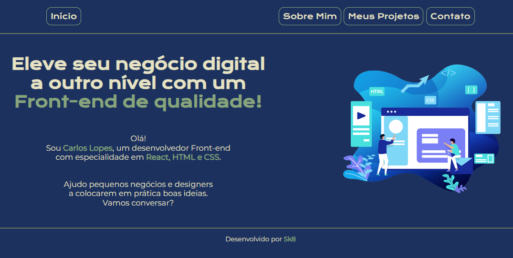

### Revisão de Web - Html, CSS

# Meu Portfolio - Carlos 

### FORMAÇÃO ALURA: "A partir do zero: HTML e CSS para projetos web"

Portfólio pessoal responsivo usando HTML5 e CSS3.
Utilizadas técnicas de design e de responsividade. Baseado na Formação  ["A partir do zero: HTML e CSS para projetos web"](https://cursos.alura.com.br/formacao-html-css) da Alura, sendo refatorado para uso e gosto pessoal.

Sites ferramentas:
- [Flat Icon](https://www.flaticon.com/br/) "favicon" e imagens
- [Google fonts](fonts.google.com) "fontes online"
- [Netlify](netlify.com) "hospedagem gratuita do site"
- [Alura](https://cursos.alura.com.br/) "aprendizado"
- [Google](google.com) "pesquisa"

Site Hospedado: [Portfolio Carlos Lopes](https://portfoliocarloslopes.netlify.app/)